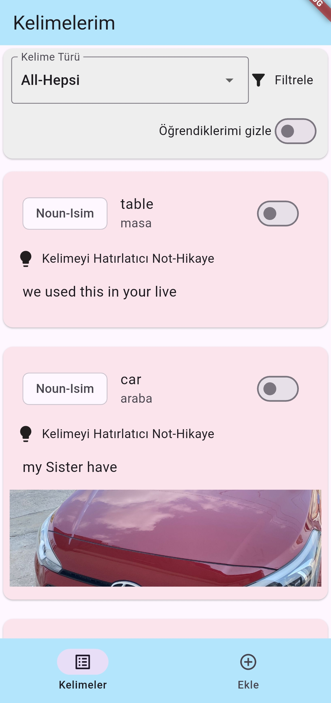
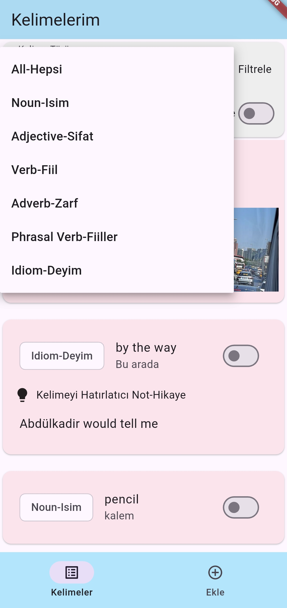
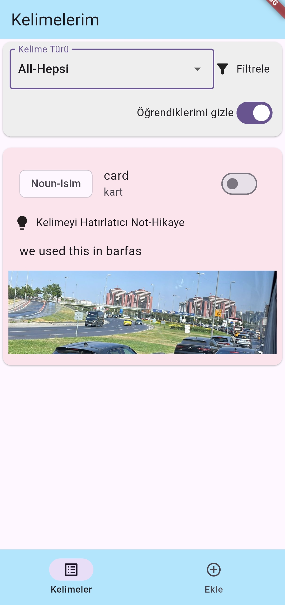
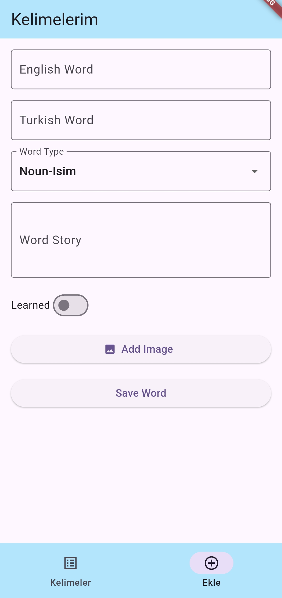
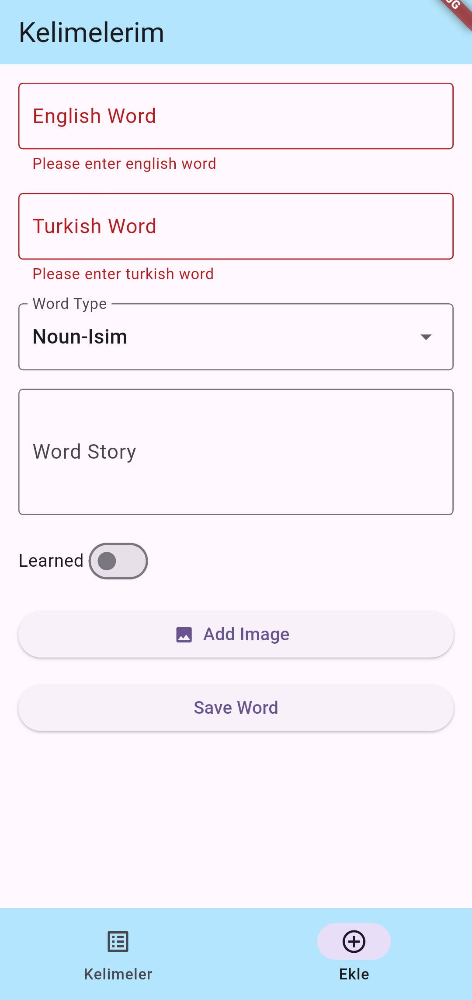
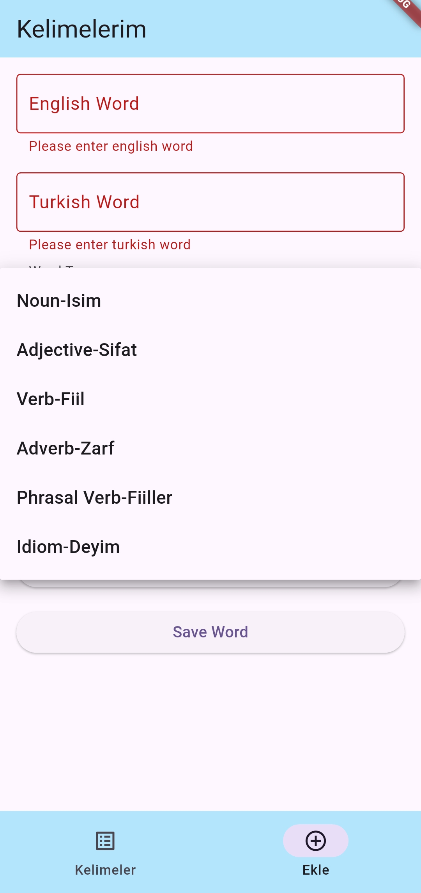
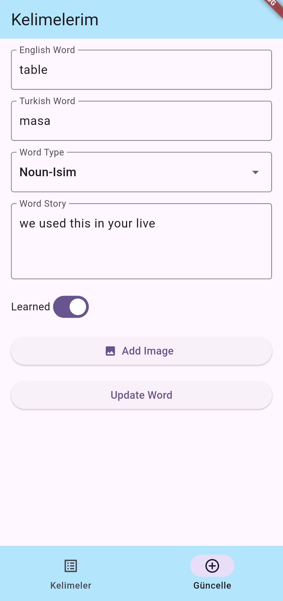
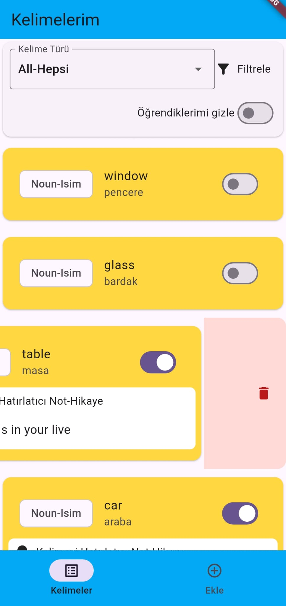
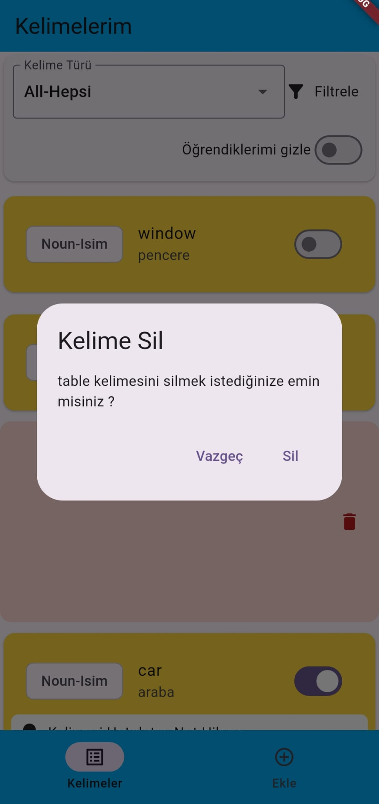

# hava_durumu_uygulamasi

Bu Flutter projesi, kullanıcının sadece belirli yerleri istediği ve
bu istediği illerin hava durumunu getiren basit ve öğretici bir uygulamadır.
Uygulama, **MVVM (Model-View-ViewModel)** tasarım desenine uygun olarak geliştirilmiştir.

---

## 📱 Ekran Görüntüleri

  <table>
    <tr>
      <td align="center" style="padding: 10px 15px;">
         
        Giris Ekranı
      </td>
      <td align="center" style="padding: 10px 15px;">
         
        Filtreleme Seçme 
      </td>
      <td align="center" style="padding: 10px 15px;">
         
        Swach Buton Çalışması
      </td>
    </tr>
    <tr>
      <td align="center" style="padding: 10px 15px;">
         
        Kelime Ekleme Sayfası
      </td>
      <td align="center" style="padding: 10px 15px;">
         
        Veri Girildi mi Kontrolleri
      </td>
      <td align="center" style="padding: 10px 15px;">
         
        Kelimeye Alan Girme 
      </td>
    </tr>
    <tr>
      <td align="center" style="padding: 10px 15px;">
         
        Kelime Güncelleme Alanı
      </td>
      <td align="center" style="padding: 10px 15px;">
         
        Veri Silme
      </td>
      <td align="center" style="padding: 10px 15px;">
         
        Silme İşlemini Onaylama
      </td>
    </tr>
  </table>

---

## 🛠️ Kullanılan Kavramlar

* **Isar Init Fonksiyonunun Yazılması ve Schema Oluşturma** 
* **Isar Servisindeki Fonksiyonların Yazılması** 
* **Bottom NavBar ve Ekranların Oluşturulması** 
* **Kelimelerin Getirilip FutureBuilder ile Listelenmesi** 
* **Kelime Ekleme Formu ve Resim Seçme Özelliği** 
* **Kelimelerin Lokal Veritabanına Kaydedilmesi** 
* **Dismissible Widget ve Kelimenin Silinmesi** 
* **Kelimelerin Filtrelenmesi İşlemleri** 

---

## ⚙️ Kullanılan Teknolojiler

* **Flutter:** Mobil uygulama geliştirme çerçevesi.
* **Dart:** Flutter'ın kullandığı programlama dili.
* **Isar:** Lokal Veri Tabanı Kütüphanesi